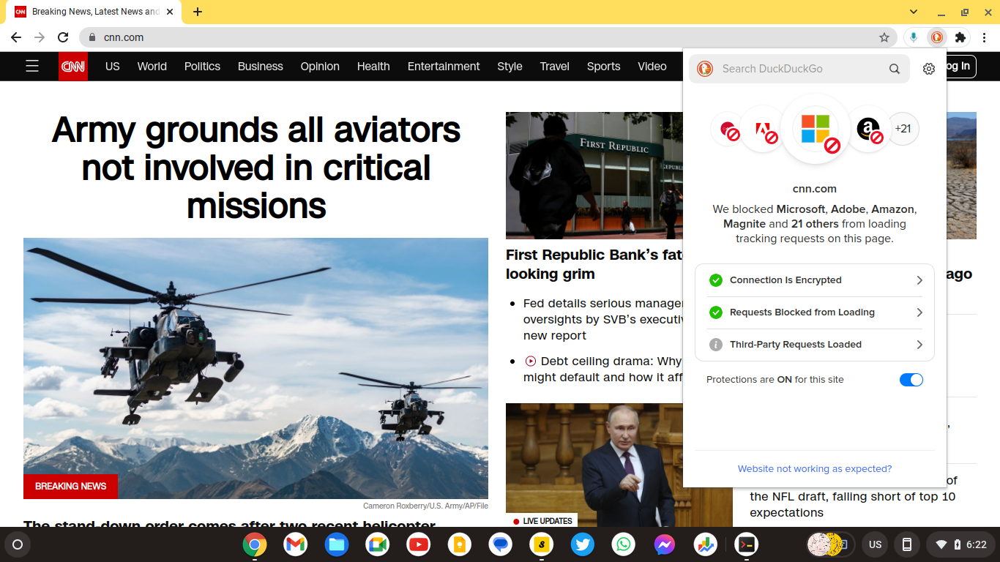

----

This is a clean internet publication : a collection of Urdu and Hindi poems of `Madan Maholvi`.

## Navigation and icons:

- cheeseburger on top left <i class="fa fa-fw fa-bars"></i> toggles the chapters' sidebar. On mobile devices, you may swap right. 
- search the publication using the magnifying glass: <i class="fa fa-fw fa-search"></i> 
- turn pages by clicking the left and right angles:<i class="fa fa-fw fa-angle-left"></i> <i class="fa fa-fw fa-angle-right"></i>. On mobile devices, the angles show up at the bottom of page.
- you can also navigate with left and right arrows on keyboard.

## Clean internet 

Just the way oceans are filled up with plastics, the internet is infected with countless cookies and trackers. Some of them useful for the functions of websites - but most to profile the users - to serve them pesky ads. Put together, they have turned the internet into a surveillance apparatus. 

An immune response is the rise of freedom tech - privacy tools - VPNs, ad-blockers, encrypted chats, and scramblers.  These tools are not only complicated, they make internet slow. My aspiration is to provide a reading experience as it was meant to be - Cookies free, Trackers free, Advertising free - without the reader having to use privacy crutches. 

A publisher may infest webpages sometimes unknowingly. Plug and play code such as Google Analytics are easy to install if not pre-installed. They however breach the sacred trust between a reader and publisher. A good reading experience is not only a readers' right, it is also a good design choice - it makes pages load faster. 

 

In order to keep their services free - email, search, social - likes of Google and Facebook turned the internet into an advertising platform. Every click is analyzed at the perils of reading experience - to place clickbaits. But If you thought they were the only culprits, you would be surprised ! CNN  uses as many as 21 trackers! And most other trusted names are equally bad. 

As a reader, you have options to block cookies through browser settings. But most of the time such choices are binary - yes or no. If you chose "No", you won't be able to load most of the websites. In effect, such settings are useless to an average user. 

A better compromise is to use [duckduck go](https://chromewebstore.google.com/detail/duckduckgo-privacy-essent/bkdgflcldnnnapblkhphbgpggdiikppg)  privacy extension. It stops trackers (and cookies) that are there for the sole purpose of profiling, but it allows those needed for the application functions. Not an ideal case but still the best among available options. 

As a rule, and design imperative, I don't use any trackers or cookies whatsoever. 

**The goal is NOT to fight ! Internet is too big to change and all models of content delivery may co-exist! It is only to do my part as a digital native - leave the place as clean as I found it.**

## Open source tools

Since web-browser is a general purpose application, fine-tuning it for readability is somewhat a necessity. I use an open source publishing tool [mdBook](https://github.com/rust-lang/mdBook) to bind these pages into a book-like reading experience. The web-app thus created has many features :  

 

- It handles layout and responsive design, so my mind stays on the content - instead of technology. 
- It keeps the essential book experience intact - even on a tablet or smartphone.
- Website may be installed like an app. Browser based apps are called [progressive web apps](https://developer.mozilla.org/en-US/docs/Web/Progressive_web_apps/Guides/What_is_a_progressive_web_app). They can be installed on computers or smart devices for offline reading.

Content is written in Markdown on Vim - both open and time tested. I mostly use Debian - a fully open distribution of Linux.

## Theme

The theme is a [custom design](https://github.com/ashutoshmjain/maholvi). A golden background with black `Alkatra` fonts form `Suman Bhandary`. I have restricted other standard themes, such as rust, ayu or navy because this custom theme is the (only) one I test from readability standpoint.

## Favicon

The favicon for this web-app is a [Trefoil Knot](https://en.wikipedia.org/wiki/Trefoil_knot). Trefoil is the first non-trivial knot - it can't be simplified into an "unknot" (a circle). In `Vaidik` thought trefoil (`triguna`) is the fundamental `Karm Bandhan`. The three colors indicate the three basic potencies of creation - the color charges of particle physics or the three `gunas` of `Vaidik` science.

## Cover photo

The cover picture is a pencil sketch of `Ganesa` by [Madan Maholvi](https://poems.shutri.com). 

In `Hindu` mythology, `Ganesa` is the embodiment of superior intelligence. `Ganesa` being the mind child of `Siva` represents the supreme consciousness. As per `Vaidik` science, the evolution (rise of consciousness) takes place to answer the question - "who am I?" The limitation, however, is `Ganesa` can't suggest the questions, he can only provide the answers. Framing the right set of questions is thus left to the evolution. 

> One who has all the answers doesn't know of any question!

## Licence

The publication is under creatives common v1.0. Which means everything is under public domain.  The fonts used are under SIL OPEN FONT LICENSE Version 1.1 - 26 February 2007

The net of this license is as below

 

## Style 

- I normally use `maroon` color to highlight a word. 
- [Hyperlinks](https://shutri.com) are in "blue" color. 
- The background color is Gold #a6a6a6
- The font is Alkatra.

## Tips and Donations:

Tips normally mean you are happy with your worker. Donations are something that show you support a cause. I may be wrong in my definitions - but you can't go wrong in supporting this work - either "tips" or "donations" - both are welcome. You can use the donation box below to send money in `Satoshies` - commonly called `Sats`. Sats are convenient because there is no credit card involved or computations for the exchange rates - it is one simple global money for the internet.

<lightning-widget 
  name="Thanks fror supporting the publication" 
  accent="#c8c8c8" 
  to="shutosha@primal.net" 
  image="https://nostrcheck.me/media/5af0794606a15b5641e25aa23d04af4cb0d7d5e68b11cacb47e56a4698fca8c4/49ff6d00cb5bc819cd19f77783d4815fbd46a5b99b6fbdead1eaecfab798187b.webp" 
/>

To send Sats with above widget, you will need a "lighning wallet" . Please visit for [free lighning address](https://lightningaddress.com/).
